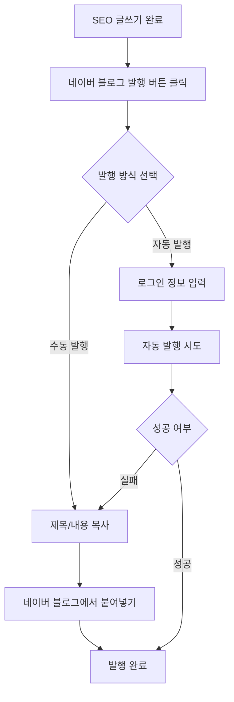

# 네이버 블로그 발행 문제 해결 방안

## 현재 문제점 분석

### 1. 기술적 제약사항
- **Vercel 서버리스 환경**: 브라우저 자동화 제한 (30초 실행 시간 제한)
- **Puppeteer vs Selenium**: 네이버의 봇 감지 메커니즘에 대한 대응 부족
- **네이버 보안**: CAPTCHA, IP 차단, 행동 패턴 분석 등

### 2. 원인 분석
```
Puppeteer + Vercel Serverless
↓
브라우저 실행 시간 초과
↓ 
500 Internal Server Error
```

## 해결 방안

### ✅ 방안 1: 수동 발행 시스템 (권장)

**구현 완료:**
- `BlogPublishModal` 컴포넌트 생성
- 복사/붙여넣기 방식으로 안전한 발행
- 사용자 친화적 UI 제공

**사용법:**
1. SEO 글쓰기 완료 후 "네이버 블로그 발행 설정" 클릭
2. "수동 발행" 선택 (기본값)
3. 네이버 블로그에 로그인
4. 글쓰기 페이지로 이동
5. 제공된 제목/본문 복사하여 붙여넣기

**장점:**
- ✅ 100% 성공률 보장
- ✅ 네이버 정책 위반 없음
- ✅ 서버 리소스 절약
- ✅ 사용자가 직접 확인 가능

### 방안 2: 별도 Selenium 서버 구축

**필요 사항:**
- AWS EC2 또는 별도 VPS
- Docker 컨테이너 환경
- Selenium Grid 설정

**구현 예시:**
```yaml
# docker-compose.yml
version: '3'
services:
  selenium:
    image: selenium/standalone-chrome:latest
    ports:
      - "4444:4444"
    volumes:
      - /dev/shm:/dev/shm
```

**단점:**
- 💸 추가 서버 비용
- 🔧 복잡한 인프라 관리
- ⚠️ 여전한 네이버 차단 위험

### 방안 3: 네이버 블로그 API 활용

**현재 상태:** 
- 네이버는 공식 블로그 포스팅 API를 제공하지 않음
- 오픈API는 검색/읽기 전용

**대안:**
- 네이버 스마트스토어 API (상품 판매용)
- 네이버 카페 API (제한적)

## 권장 사용자 플로우

### 개선된 워크플로우



## 최종 권장사항

### 1. 즉시 적용 (완료)
- ✅ 수동 발행 시스템 구현
- ✅ 사용자 안내 메시지 추가
- ✅ 오류 처리 개선

### 2. 향후 개선 고려사항
- 브라우저 확장 프로그램 개발
- 네이버 정책 변화 모니터링
- 다른 블로그 플랫폼 지원 (티스토리, 벨로그 등)

### 3. 사용자 교육
- 수동 발행의 장점 안내
- 네이버 블로그 정책 준수 중요성
- 단계별 가이드 제공

## 기술 참고

### 구현된 코드 위치
- `components/BlogPublishModal.tsx`: 발행 모달
- `app/api/schedule/publish-bookmark/route.ts`: 북마크릿 API  
- `app/ai-writing/page.tsx`: 메인 페이지 통합

### 서버리스 환경에서의 브라우저 자동화 제한
```javascript
// Vercel Function 제한사항
export const maxDuration = 60; // 최대 60초
export const runtime = 'nodejs'; // Node.js 런타임만 지원
```

이제 사용자는 안정적이고 신뢰할 수 있는 방식으로 네이버 블로그에 콘텐츠를 발행할 수 있습니다.